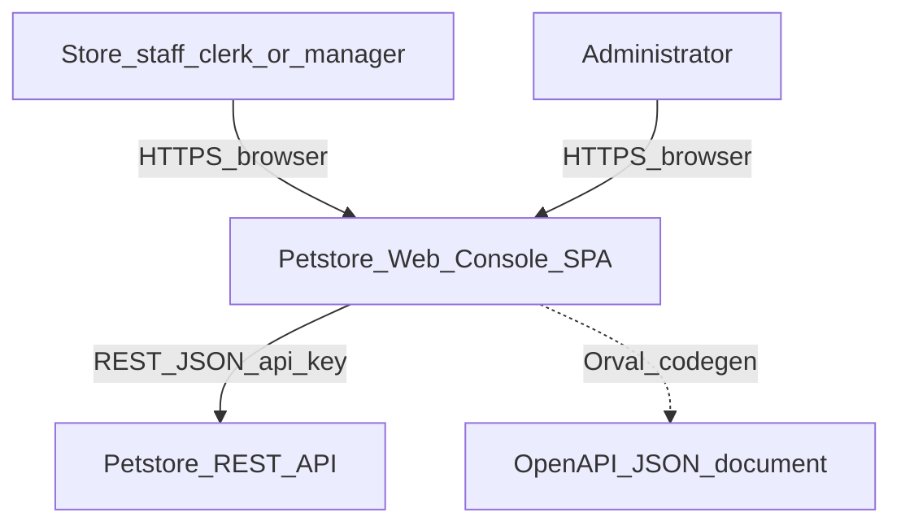
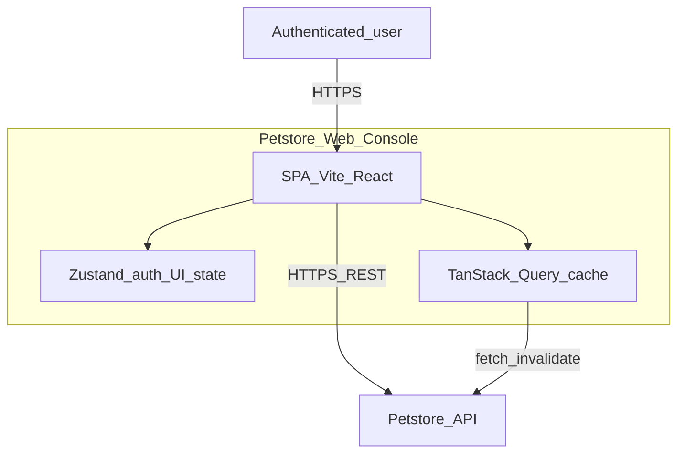
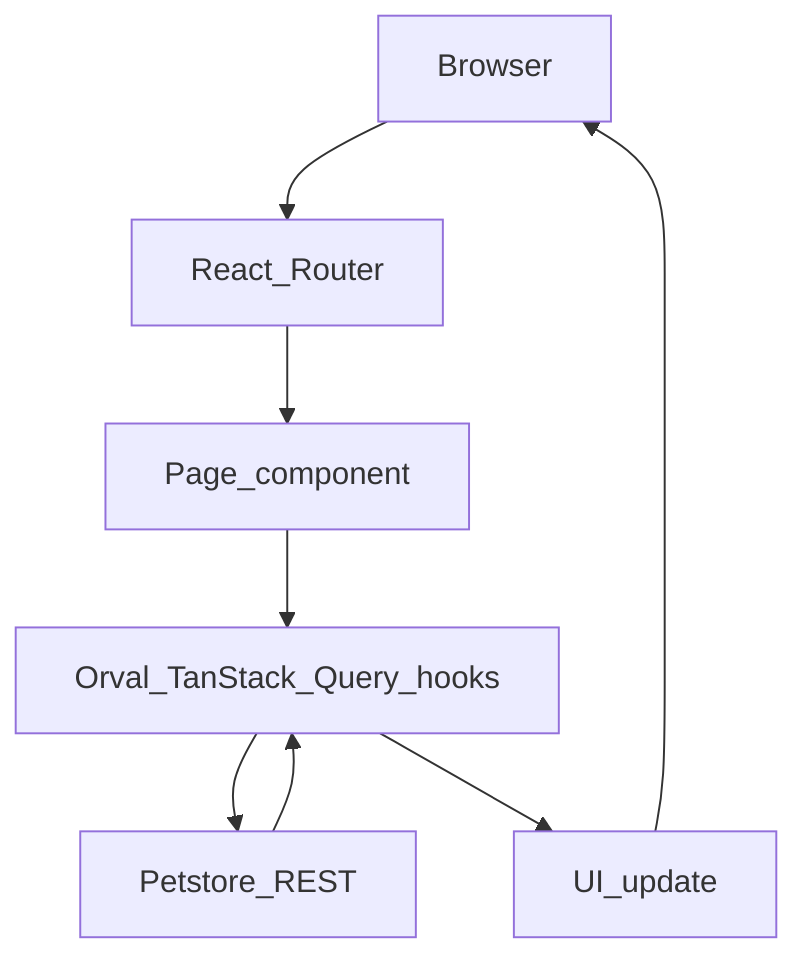

# TSD — petstore-web-console

> Assembled from [STACK.md](../stack/STACK.md), [DEPLOYMENT.md](../deployment/DEPLOYMENT.md), [PATTERNS.md](../patterns/PATTERNS.md), [SCHEMA.md](../schema/SCHEMA.md), [PRD-petstore-web-console.md](../functional/PRD-petstore-web-console.md). **C4-style diagrams** below use Mermaid `flowchart` for broad renderer support (see note in §5.0).

## 1) Service overview

| Field | Value |
|-------|--------|
| **Name** | petstore-web-console |
| **Purpose** | Staff-facing SPA for pets, inventory, orders, and admin users |
| **Primary responsibilities** | UI for Petstore API; client-side pagination/sort/filter; auth session; design-system fidelity |
| **In-scope capabilities** | FR-001–FR-022 per [PRD](../functional/PRD-petstore-web-console.md) |
| **Out-of-scope** | Backend/BFF, SSR, mobile v1, charts on inventory, extended pet attributes v1 |
| **Related components** | Petstore REST API (external) |

---

## 2) Tech stack summary

| Area | Technology | Version | Evidence |
|------|------------|---------|----------|
| Framework | React + Vite | 19 / 6 | [STACK.md](../stack/STACK.md) §2 |
| Language | TypeScript | 5.x strict | [STACK.md](../stack/STACK.md) |
| Routing | React Router | v7 | [STACK.md](../stack/STACK.md) |
| Server state | TanStack Query | v5 | [STACK.md](../stack/STACK.md) |
| Client state | Zustand | v5 | [STACK.md](../stack/STACK.md) |
| Forms | RHF + Zod | v7 | [STACK.md](../stack/STACK.md) |
| UI | shadcn/ui + Tailwind | v4 | [STACK.md](../stack/STACK.md) |
| API | Orval | v8 | [STACK.md](../stack/STACK.md) |
| Auth | react-oidc-context | — | [STACK.md](../stack/STACK.md) |
| Tests | Vitest, RTL, Playwright, MSW | — | [STACK.md](../stack/STACK.md) |

---

## 3) Project structure

| Module/folder | Responsibility | Evidence |
|-----------------|----------------|----------|
| `frontend/src/pages/` | Routed screens | [plan.md](../../specs/001-petstore-web-console/plan.md) |
| `frontend/src/components/` | layout, ui, feature components | [plan.md](../../specs/001-petstore-web-console/plan.md) |
| `frontend/src/api/` | Orval-generated client + hooks | [plan.md](../../specs/001-petstore-web-console/plan.md) |
| `frontend/src/stores/` | Auth + UI preferences | [plan.md](../../specs/001-petstore-web-console/plan.md) |
| `frontend/src/lib/` | api-client, error-mapper | [plan.md](../../specs/001-petstore-web-console/plan.md) |
| `specs/001-petstore-web-console/` | SDD artifacts | Repository |

---

## 4) Deployment and runtime topology

### 4.1 Deployable units

| Unit | Type | Produced by | How started | Evidence |
|------|------|---------------|-------------|----------|
| SPA | Static assets (planned) | `frontend/` Vite build | Dev: Vite; prod: unknown host | [DEPLOYMENT.md](../deployment/DEPLOYMENT.md) |

### 4.2 Runtime topology

- **Process model:** Browser-only app + external API ([DEPLOYMENT.md](../deployment/DEPLOYMENT.md)).
- **Ports:** HTTPS to API; dev server port not fixed in specs ([DEPLOYMENT.md](../deployment/DEPLOYMENT.md)).
- **Config:** API base URL / OpenAPI URL ([STACK.md](../stack/STACK.md) §4.2).
- **Secrets:** Tokens per auth design — **REDACTED** in docs; never commit ([ui-api-contract.md](../../specs/001-petstore-web-console/contracts/ui-api-contract.md)).

### 4.3 Service model classification

- **Model today:** SPA + remote API ([DEPLOYMENT.md](../deployment/DEPLOYMENT.md) §6).
- **Rubric:** See [DEPLOYMENT.md](../deployment/DEPLOYMENT.md) table.

---

## 5) Architecture

### 5.0 System context (flowchart)

**Actors and systems from PRD + deployment.**

### 5.0.1 Container diagram (flowchart)

### 5.1 Style and key patterns

- **Style:** Contract-first SPA, thin client, Stitch design system ([constitution.md](../../.specify/memory/constitution.md)).
- **Patterns:** Orval + TanStack Query; RHF+Zod; error-mapper; feature folders ([PATTERNS.md](../patterns/PATTERNS.md)).

### 5.2 Representative request flow

**Mutations:** Same path; invalidate keys per [ui-api-contract.md](../../specs/001-petstore-web-console/contracts/ui-api-contract.md).

### 5.3 Data flow

- **Datastores:** No local DB; Query cache + Zustand for session/UI ([SCHEMA.md](../schema/SCHEMA.md); [PATTERNS.md](../patterns/PATTERNS.md)).
- **Queues:** None.

---

## 6) Data model summary

### 6.1 Entity overview

| Entity | Purpose | Key relationships | Sensitivity |
|--------|---------|-------------------|-------------|
| Pet | Catalogue core | Category, Tags, Orders | Low |
| Category | Pet classification | 1:N Pet | None |
| Tag | Search labels | M:N Pet | None |
| Order | Purchases | N:1 Pet | Operational |
| User | Staff accounts | Standalone | PII |

**Detail:** [SCHEMA.md](../schema/SCHEMA.md).

### 6.2 Key schema patterns

- Pet and Order status enums; cancel rules on Order ([SCHEMA.md](../schema/SCHEMA.md) §5).

---

## 7) External dependencies

| Name | Type | Direction | Purpose | Evidence |
|------|------|-----------|---------|----------|
| Petstore API | REST | Outbound | All domain operations | [DEPLOYMENT.md](../deployment/DEPLOYMENT.md) §5 |
| OpenAPI doc | HTTPS | Outbound | Codegen | [quickstart.md](../../specs/001-petstore-web-console/quickstart.md) |

---

## 8) Configuration and environment

### 8.1 Config sources

- Build-time / env for API base URL (planned); OpenAPI URL in quickstart ([STACK.md](../stack/STACK.md)).

### 8.2 Key parameters

| Category | Key | Value (safe) | Evidence |
|----------|-----|--------------|----------|
| Integration | OpenAPI URL | `https://petstore3.swagger.io/api/v3/openapi.json` | [ui-api-contract.md](../../specs/001-petstore-web-console/contracts/ui-api-contract.md) |
| Security | api_key header | Session token after login | [ui-api-contract.md](../../specs/001-petstore-web-console/contracts/ui-api-contract.md) |

---

## 9) Constraints

| Constraint | Evidence |
|------------|----------|
| No backend in repo | [constitution.md](../../.specify/memory/constitution.md) III |
| No hand-written API types | [constitution.md](../../.specify/memory/constitution.md) I |
| Client-side pagination/sort | [spec.md](../../specs/001-petstore-web-console/spec.md) |

---

## 10) Assumptions and open questions

Aligned with [PRD §9](../functional/PRD-petstore-web-console.md#9-assumptions-and-open-questions).

---

## Related specifications

- [PRD-petstore-web-console.md](../functional/PRD-petstore-web-console.md)
- [PATTERNS.md](../patterns/PATTERNS.md)
- [SCHEMA.md](../schema/SCHEMA.md)

---

*Phase: architecture — 2026-03-23*
