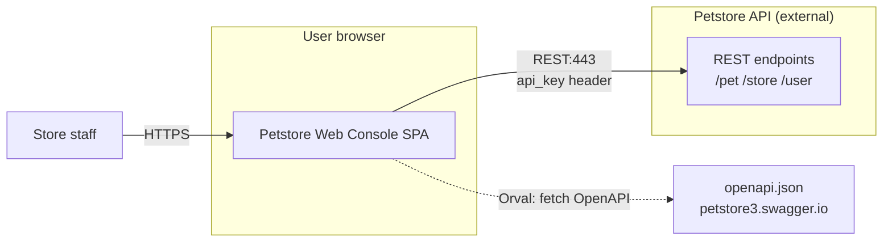

# petstore-web-console — Deployment Baseline

> **Provenance:** Specifications and UI/API contract. No Dockerfile, Kubernetes manifests, or CI workflows exist in this repository.

## 1) Deployable units

### Unit: Petstore Web Console SPA (planned)

| Attribute | Value | Evidence |
|-----------|--------|----------|
| Type | Static SPA (Vite build) | [plan.md](../../specs/001-petstore-web-console/plan.md) Project Type |
| Produced by module | `frontend/` (planned) | [plan.md](../../specs/001-petstore-web-console/plan.md) § Source Code |
| How started | `vite` dev server locally; production: static host **unknown** | [quickstart.md](../../specs/001-petstore-web-console/quickstart.md); gap — no deploy config |
| Process model | Single browser tab / single JS app | SPA model |
| Ports | Dev: typical Vite `5173` (conventional, not pinned in spec) | Gap — not in repo config |
| Backend | External Petstore API (not deployed from this repo) | [spec.md](../../specs/001-petstore-web-console/spec.md) Assumptions |

---

## 2) Runtime topology

### 2.1 Process model

- **Single vs multi-process:** One browser application; no server process in this repo.
- **Container orchestration:** None detected.
- **Evidence:** Repository lacks `Dockerfile`, `k8s/`.

### 2.2 Host / OS assumptions

- **Client OS:** Desktop and tablet browsers ([plan.md](../../specs/001-petstore-web-console/plan.md) Target Platform).
- **Mobile:** Out of scope v1 ([spec.md](../../specs/001-petstore-web-console/spec.md) Assumptions).

### 2.3 Networking

- **Egress:** HTTPS from browser to Petstore API host.
- **Evidence:** [ui-api-contract.md](../../specs/001-petstore-web-console/contracts/ui-api-contract.md) — base URL `https://petstore3.swagger.io/...` (OpenAPI document URL in contract header).

---

## 3) Configuration at runtime

### 3.1 Data sources

| Name/key | DB type | Connection info (safe) | Evidence |
|----------|---------|------------------------|----------|
| Petstore API | Remote REST | Public demo API host per contract | [ui-api-contract.md](../../specs/001-petstore-web-console/contracts/ui-api-contract.md) |

No local database or cache tier is defined for the SPA in specs.

### 3.2 Environment configuration

| Key | Purpose | Category | Evidence |
|-----|---------|----------|----------|
| (planned) API base URL | Target Petstore server | integration-endpoints | [quickstart.md](../../specs/001-petstore-web-console/quickstart.md) Orval config note |
| Session token | Authenticated API calls | security | [ui-api-contract.md](../../specs/001-petstore-web-console/contracts/ui-api-contract.md) `api_key` header |

---

## 4) Data and state

- **Shared schema:** N/A locally; API owns data.
- **Session/state:** Client-side; token in memory per [ui-api-contract.md](../../specs/001-petstore-web-console/contracts/ui-api-contract.md) Session Management.
- **Cache:** TanStack Query in-memory cache (client).
- **Evidence:** [plan.md](../../specs/001-petstore-web-console/plan.md); [ui-api-contract.md](../../specs/001-petstore-web-console/contracts/ui-api-contract.md) Cache Invalidation.

---

## 5) Communication and integration

| Channel | Type | Direction | Endpoint/topic | Evidence |
|---------|------|-----------|----------------|----------|
| Pet CRUD and queries | REST | Outbound | `/pet/*` | [ui-api-contract.md](../../specs/001-petstore-web-console/contracts/ui-api-contract.md) |
| Store / inventory / orders | REST | Outbound | `/store/*` | [ui-api-contract.md](../../specs/001-petstore-web-console/contracts/ui-api-contract.md) |
| Users | REST | Outbound | `/user/*` | [ui-api-contract.md](../../specs/001-petstore-web-console/contracts/ui-api-contract.md) |
| Login/logout | REST | Outbound | `/user/login`, `/user/logout` | [ui-api-contract.md](../../specs/001-petstore-web-console/contracts/ui-api-contract.md) Authentication Contract |
| OpenAPI document | HTTPS GET | Outbound | `https://petstore3.swagger.io/api/v3/openapi.json` | [ui-api-contract.md](../../specs/001-petstore-web-console/contracts/ui-api-contract.md) header |

### 5.1 Integration diagram

---

## 6) Service model classification

| Dimension | Monolith signal | Microservice signal | Current state | Evidence |
|-----------|-----------------|---------------------|---------------|----------|
| Deployability | Single SPA artifact | N/A | **Single planned SPA** | [plan.md](../../specs/001-petstore-web-console/plan.md) |
| Runtime isolation | Browser only | API is separate system | **Client + external API** | [spec.md](../../specs/001-petstore-web-console/spec.md) |
| Data ownership | No local DB | API owns data | **API owns persistence** | [data-model.md](../../specs/001-petstore-web-console/data-model.md) |
| Communication | HTTP to API | — | **Network REST** | [ui-api-contract.md](../../specs/001-petstore-web-console/contracts/ui-api-contract.md) |
| Scaling | Not specified | — | **Unknown** | Gap |
| Team ownership | Unknown | — | **Unknown** | No CODEOWNERS |

### Conclusion

- **Model today (specified):** Single-page **frontend module** integrating with a **remote monolithic API** (Petstore demo service).
- **Why:** All persistence and business rules on API side; console is a thin client ([constitution.md](../../.specify/memory/constitution.md) III).
- **Constraints:** No BFF; features limited to OpenAPI surface ([constitution.md](../../.specify/memory/constitution.md) I, III).
- **Open questions:** Production hosting, OIDC provider endpoints, and exact base URL configuration for non-demo environments.

---

## Related specifications

- [STACK.md](../stack/STACK.md)
- [PATTERNS.md](../patterns/PATTERNS.md)
- [SCHEMA.md](../schema/SCHEMA.md) — API-aligned entities

---

*Phase: deployment — 2026-03-23*
