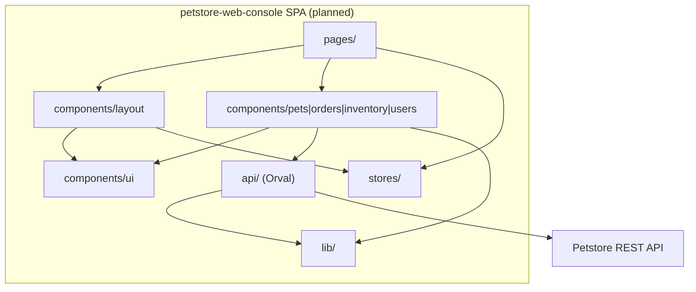

# petstore-web-console — Design Patterns Baseline

> **Provenance:** Planned architecture from [plan.md](../../specs/001-petstore-web-console/plan.md) and [constitution.md](../../.specify/memory/constitution.md). No source imports exist yet.

## 1) Framework patterns

### 1.1 Web / API pattern

- **Pattern:** React SPA with client-side routing; UI actions map to REST endpoints via generated clients.
- **Where used:** All screens under planned `frontend/src/pages/`.
- **Evidence:** [plan.md](../../specs/001-petstore-web-console/plan.md) Project Structure; [ui-api-contract.md](../../specs/001-petstore-web-console/contracts/ui-api-contract.md).

### 1.2 Dependency injection

- **Pattern:** React component tree + hooks; no Spring-style DI. Orval-generated hooks receive `QueryClient` via TanStack Query provider.
- **Evidence:** [plan.md](../../specs/001-petstore-web-console/plan.md) `App.tsx` Router + QueryClientProvider + AuthProvider.

### 1.3 Data access pattern

- **Pattern:** **Repository-like API layer** via Orval-generated functions and TanStack Query hooks; no local ORM.
- **Evidence:** [research.md](../../specs/001-petstore-web-console/research.md) Decision 3; [constitution.md](../../.specify/memory/constitution.md) I.

---

## 2) Intentional design patterns

### Pattern: API-contract-first code generation (Confidence: High)

- **Intent:** Single source of truth from OpenAPI; compiler catches drift.
- **Evidence:**
  - **Files:** [constitution.md](../../.specify/memory/constitution.md) Principle I; [plan.md](../../specs/001-petstore-web-console/plan.md) `orval.config.ts`, `src/api/`
  - **Wiring:** Orval → `src/api/` per [quickstart.md](../../specs/001-petstore-web-console/quickstart.md)
- **Why it qualifies:**
  - Explicit prohibition of hand-written API types ([constitution.md](../../.specify/memory/constitution.md) I).
  - Orval + TanStack Query is the locked choice ([constitution.md](../../.specify/memory/constitution.md) Technology Boundaries).

### Pattern: Server vs client state split (Confidence: High)

- **Intent:** TanStack Query for server data; Zustand for minimal UI/auth state.
- **Evidence:** [research.md](../../specs/001-petstore-web-console/research.md) Decision 5; [constitution.md](../../.specify/memory/constitution.md) VI (no Redux).
- **Why it qualifies:** Constitution explicitly limits state libraries ([constitution.md](../../.specify/memory/constitution.md) VI).

### Pattern: Form validation aligned with API schemas (Confidence: High)

- **Intent:** RHF + Zod resolvers using same schemas as Orval output.
- **Evidence:** [constitution.md](../../.specify/memory/constitution.md) IV; [research.md](../../specs/001-petstore-web-console/research.md) Decision 4.

---

## 3) Architectural patterns

### 3.1 Layering

- **Observed (planned) layers:** `pages` → `components` → `api` / `lib` → HTTP; `stores` for client state.
- **Evidence:** [plan.md](../../specs/001-petstore-web-console/plan.md) directory tree under `frontend/src/`.
- **Violations:** None in code (no code yet).

### 3.2 Modular boundaries

| Module | Responsibility | Key interfaces | Coupling hotspots |
|--------|----------------|----------------|-------------------|
| `pages/` | Route-level screens | Router, page components | Depends on components + hooks |
| `components/ui/` | shadcn primitives | Radix-based components | Shared everywhere |
| `components/{pets,orders,inventory,users}/` | Feature UI | Feature props, callbacks | Calls into `api` via hooks |
| `api/` | Generated client + hooks | Orval exports | All features depend on API shape |
| `stores/` | Auth, UI preferences | Zustand store | Used by layout and forms |
| `lib/` | api-client, error-mapper | Fetch wrapper, mappers | Cross-cutting |

**Evidence:** [plan.md](../../specs/001-petstore-web-console/plan.md) § Source Code.

### 3.3 Module dependency diagram

**Direction:** “depends on” / “calls into” as documented in plan (not derived from imports).

**Coupling note:** `api/` is a hotspot — all feature areas depend on generated hooks/types.

### 3.5 Integration patterns

| Pattern | Type | Evidence |
|---------|------|----------|
| REST JSON | Synchronous HTTP | [ui-api-contract.md](../../specs/001-petstore-web-console/contracts/ui-api-contract.md) |
| Session header | `api_key` on requests | [ui-api-contract.md](../../specs/001-petstore-web-console/contracts/ui-api-contract.md) Request Headers |
| Cache invalidation | TanStack Query keys | [ui-api-contract.md](../../specs/001-petstore-web-console/contracts/ui-api-contract.md) Cache Invalidation Strategy |

---

## 4) Cross-cutting patterns

### 4.1 Transaction management

- **Approach:** N/A locally; API owns transactions.
- **Evidence:** [data-model.md](../../specs/001-petstore-web-console/data-model.md).

### 4.2 Error handling

- **Approach:** Centralized HTTP → user message mapping (`lib/error-mapper.ts` planned).
- **Evidence:** [constitution.md](../../.specify/memory/constitution.md) V; [ui-api-contract.md](../../specs/001-petstore-web-console/contracts/ui-api-contract.md) Error Response Mapping.

### 4.3 Scheduling / background jobs

- **Framework:** None planned for SPA.
- **Evidence:** Gap — not in spec for v1 client.

### 4.4 Authentication and authorization

- **Approach:** Login via API contract; **PKCE** with react-oidc-context per research (spec mentions OAuth2 implicit; research overrides to PKCE).
- **Admin vs staff:** `userStatus` drives Users section visibility ([data-model.md](../../specs/001-petstore-web-console/data-model.md) User).
- **Evidence:** [research.md](../../specs/001-petstore-web-console/research.md) Decision 9; [spec.md](../../specs/001-petstore-web-console/spec.md) User Story 8–9.

### 4.5 Caching

- **Approach:** TanStack Query default caching + explicit invalidation table.
- **Evidence:** [ui-api-contract.md](../../specs/001-petstore-web-console/contracts/ui-api-contract.md) Cache Invalidation Strategy.

---

## 5) Candidates (unconfirmed)

| Candidate pattern | Why suspected | Missing evidence |
|-------------------|---------------|------------------|
| OIDC redirect flow details | react-oidc-context chosen | No `AuthProvider` config in repo |
| MSW test layout | Orval MSW generation mentioned | No `frontend/tests/` tree yet |

---

## Related specifications

- [STACK.md](../stack/STACK.md)
- [DEPLOYMENT.md](../deployment/DEPLOYMENT.md)
- [SCHEMA.md](../schema/SCHEMA.md)

---

*Phase: patterns — 2026-03-23*
