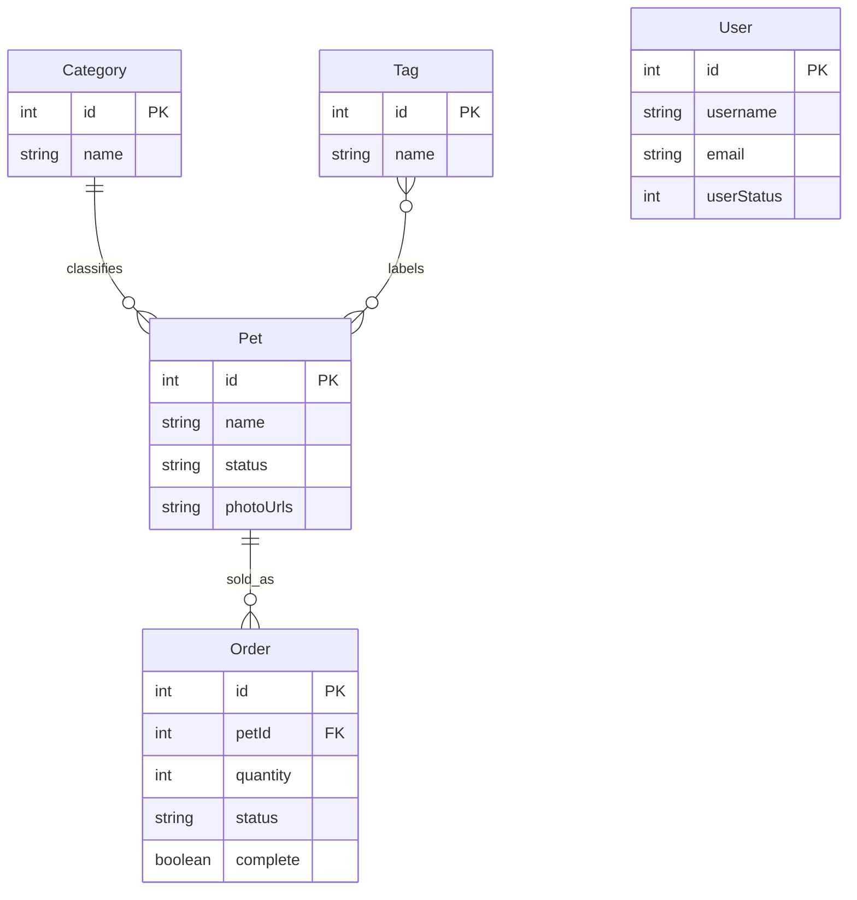

# petstore-web-console — Database Schema Baseline

> **Scope:** No local database. This document describes **API resource shapes** (OpenAPI-aligned) as specified in [data-model.md](../../specs/001-petstore-web-console/data-model.md) and [ui-api-contract.md](../../specs/001-petstore-web-console/contracts/ui-api-contract.md). Persistence lives in the Petstore service.

## 1) Schema overview

### 1.1 Database inventory

| Database | Engine | Purpose | Schema source | Evidence |
|----------|--------|---------|---------------|----------|
| (none locally) | — | — | — | [data-model.md](../../specs/001-petstore-web-console/data-model.md) intro |
| Petstore API | Remote REST / OpenAPI 3.0.4 v1.0.27 | Authoritative data | OpenAPI + feature data-model | [data-model.md](../../specs/001-petstore-web-console/data-model.md); [ui-api-contract.md](../../specs/001-petstore-web-console/contracts/ui-api-contract.md) |

### 1.2 Schema statistics

- **API entity types (documented here):** 5 — Pet, Category, Tag, Order, User.
- **Client-only derived types:** 3 — InventorySummary, AuthSession, PetFilter ([data-model.md](../../specs/001-petstore-web-console/data-model.md) Client-Side Derived Types).
- **Migration tool:** None (no local DDL).
- **Latest spec reference:** v1.0.27 per [data-model.md](../../specs/001-petstore-web-console/data-model.md).

---

## 2) Entity catalog

### Pet (`Pet` resource)

**Purpose:** Animal offered by the store; central resource for catalogue, detail, CRUD, and ordering.

**Sensitivity:** Low for pet fields; photos are URLs.

#### Attributes

| Field | Type | Nullable | Default | Constraints | Purpose |
|-------|------|----------|---------|-------------|---------|
| id | int64 | No (on read) | — | Unique | Identifier |
| name | string | No (required for create) | — | Non-empty | Display |
| category | Category object | Yes | — | — | Classification |
| photoUrls | string[] | Yes (API) / at least one on create per spec | — | First = thumbnail | Media |
| tags | Tag[] | Yes | — | — | Search/filter |
| status | enum | Yes | available | available \| pending \| sold | Catalogue filter |

#### Keys and indexes

| Name | Type | Columns | References | Evidence |
|------|------|---------|------------|----------|
| id | PK (logical) | id | — | [data-model.md](../../specs/001-petstore-web-console/data-model.md) Entity: Pet |

#### Relationships

| Relationship | Target | Type | FK column | Evidence |
|--------------|--------|------|-----------|----------|
| belongs to | Category | N:1 | category | [data-model.md](../../specs/001-petstore-web-console/data-model.md) |
| tagged with | Tag | M:N | tags[] | [data-model.md](../../specs/001-petstore-web-console/data-model.md) |
| ordered by | Order | 1:N | Order.petId | [data-model.md](../../specs/001-petstore-web-console/data-model.md) ERD |

#### Source evidence

- [data-model.md](../../specs/001-petstore-web-console/data-model.md) Entity: Pet
- [spec.md](../../specs/001-petstore-web-console/spec.md) Key Entities — Pet

---

### Category (`Category` resource)

**Purpose:** Classification for pets (e.g. Dogs, Cats).

**Sensitivity:** None.

#### Attributes

| Field | Type | Nullable | Constraints | Purpose |
|-------|------|----------|---------------|---------|
| id | int64 | No (on read) | Unique | Identifier |
| name | string | Yes | — | Label |

#### Relationships

| Relationship | Target | Type | Evidence |
|--------------|--------|------|----------|
| has many | Pet | 1:N | [data-model.md](../../specs/001-petstore-web-console/data-model.md) |

---

### Tag (`Tag` resource)

**Purpose:** Labels for pet search and filter.

**Sensitivity:** None.

#### Attributes

| Field | Type | Nullable | Constraints | Purpose |
|-------|------|----------|---------------|---------|
| id | int64 | No (on read) | Unique | Identifier |
| name | string | Yes | — | Label |

#### Relationships

| Relationship | Target | Type | Evidence |
|--------------|--------|------|----------|
| many-to-many | Pet | M:N | [data-model.md](../../specs/001-petstore-web-console/data-model.md) |

---

### Order (`Order` resource)

**Purpose:** Customer purchase of a pet; ties to pet and quantity.

**Sensitivity:** Operational; may reference customer-facing data indirectly via pet.

#### Attributes

| Field | Type | Nullable | Constraints | Purpose |
|-------|------|----------|-------------|---------|
| id | int64 | No (on read) | Unique | Order ID |
| petId | int64 | No | ≥ 1 ref | Pet reference |
| quantity | int32 | No | ≥ 1 | Line quantity |
| shipDate | ISO datetime | Yes | — | Display |
| status | enum | Yes | placed \| approved \| delivered | Cancellation rules |
| complete | boolean | Yes | — | Fulfillment flag |

#### Relationships

| Relationship | Target | Type | FK | Evidence |
|--------------|--------|------|-----|----------|
| for pet | Pet | N:1 | petId | [data-model.md](../../specs/001-petstore-web-console/data-model.md) |

#### Source evidence

- [data-model.md](../../specs/001-petstore-web-console/data-model.md) Entity: Order — Business Rules

---

### User (`User` resource)

**Purpose:** Staff account for console access and admin operations.

**Sensitivity:** **Contains PII** — username, names, email, phone; password write-only.

#### Attributes

| Field | Type | Nullable | Constraints | Purpose |
|-------|------|----------|-------------|---------|
| id | int64 | No (on read) | Unique | Identifier |
| username | string | No | Unique; lookup key | Login / URL path |
| firstName | string | Yes | — | Display |
| lastName | string | Yes | — | Display |
| email | string | Yes | Email format | Contact |
| password | string | On create | Write-only | Auth |
| phone | string | Yes | — | Contact |
| userStatus | int32 | Yes | 0 inactive, 1 active | Admin vs staff |

#### Relationships

| Relationship | Target | Type | Evidence |
|--------------|--------|------|----------|
| (independent) | — | — | [data-model.md](../../specs/001-petstore-web-console/data-model.md) ERD |

#### Source evidence

- [data-model.md](../../specs/001-petstore-web-console/data-model.md) Entity: User

---

### Derived client types (non-API persistence)

| Type | Purpose | Evidence |
|------|---------|----------|
| InventorySummary | `Record<string, number>` status → count | [data-model.md](../../specs/001-petstore-web-console/data-model.md) |
| AuthSession | Session state shape | [data-model.md](../../specs/001-petstore-web-console/data-model.md) |
| PetFilter | Catalogue filter state | [data-model.md](../../specs/001-petstore-web-console/data-model.md) |

---

## 3) Relationship map

### 3.1 ER diagram (API entities)

**Note:** M:N Pet–Tag is simplified in Mermaid as `}o--o{`; actual API embeds tags on Pet.

%% SENSITIVE: User entity — PII per data-model

### 3.3 Relationship summary table

| Parent | Relationship | Child | FK / link | Type |
|--------|--------------|-------|-----------|------|
| Category | has many | Pet | category | 1:N |
| Pet | has many tags | Tag | tags[] on Pet | M:N (as embedded) |
| Pet | has many | Order | petId | 1:N |
| User | — | — | Independent | — |

---

## 4) Enums, lookups and reference data

| Name | Type | Values | Used by | Evidence |
|------|------|--------|---------|----------|
| Pet.status | Enum | available, pending, sold | Pet, catalogue filters | [data-model.md](../../specs/001-petstore-web-console/data-model.md) |
| Order.status | Enum | placed, approved, delivered | Orders, cancel UX | [data-model.md](../../specs/001-petstore-web-console/data-model.md) |
| userStatus | Integer codes | 0 inactive, 1 active | User, admin nav | [data-model.md](../../specs/001-petstore-web-console/data-model.md) |

---

## 5) Data constraints and business rules (schema-level)

| Constraint | Resource | Rule | Evidence |
|------------|----------|------|----------|
| Name required | Pet | Non-empty on create/update | [data-model.md](../../specs/001-petstore-web-console/data-model.md) |
| photoUrls | Pet | At least one entry on create (may use placeholder) | [data-model.md](../../specs/001-petstore-web-console/data-model.md) |
| Image size | Upload | Max 5 MB client-side | [data-model.md](../../specs/001-petstore-web-console/data-model.md); [spec.md](../../specs/001-petstore-web-console/spec.md) |
| Cancel order | Order | Only when status is `placed` | [data-model.md](../../specs/001-petstore-web-console/data-model.md) |
| quantity | Order | ≥ 1 | [data-model.md](../../specs/001-petstore-web-console/data-model.md) |

---

## 6) Schema patterns observed (specified)

- **State machines:** Pet status and Order status transitions documented in prose ([data-model.md](../../specs/001-petstore-web-console/data-model.md)).
- **Soft deletes:** Not specified for API entities in feature data-model.
- **Audit columns:** Not specified in feature data-model for v1 client.

---

## 7) Gaps and open questions

| Item | Missing | Impact |
|------|---------|--------|
| Full OpenAPI field list | Only feature-level subset documented | Orval may expose additional properties |
| ApiResponse shape for upload | Named in contract table only | Detail in OpenAPI JSON |
| Indexes / DB constraints on server | Not in repo | Server-side truth |

---

## Related specifications

- [data-model.md](../../specs/001-petstore-web-console/data-model.md)
- [ui-api-contract.md](../../specs/001-petstore-web-console/contracts/ui-api-contract.md)
- [functional/PRD-petstore-web-console.md](../functional/PRD-petstore-web-console.md)

---

*Phase: schema — 2026-03-23*
