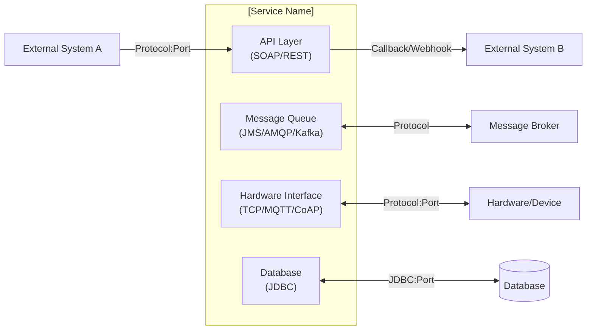
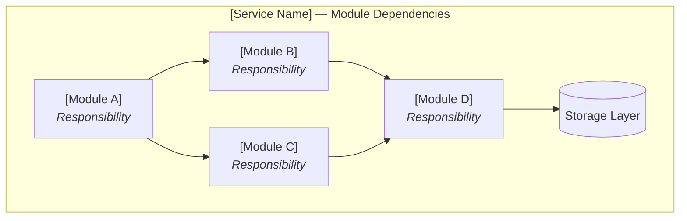
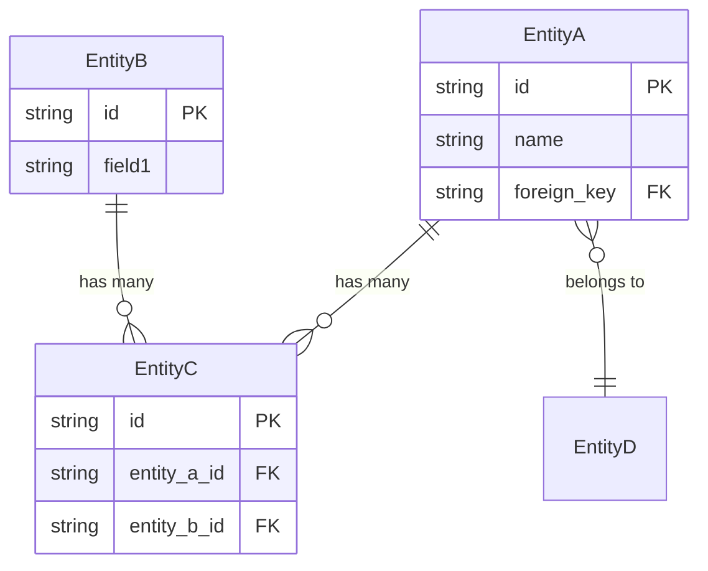
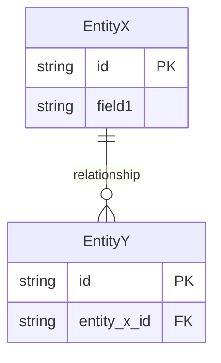
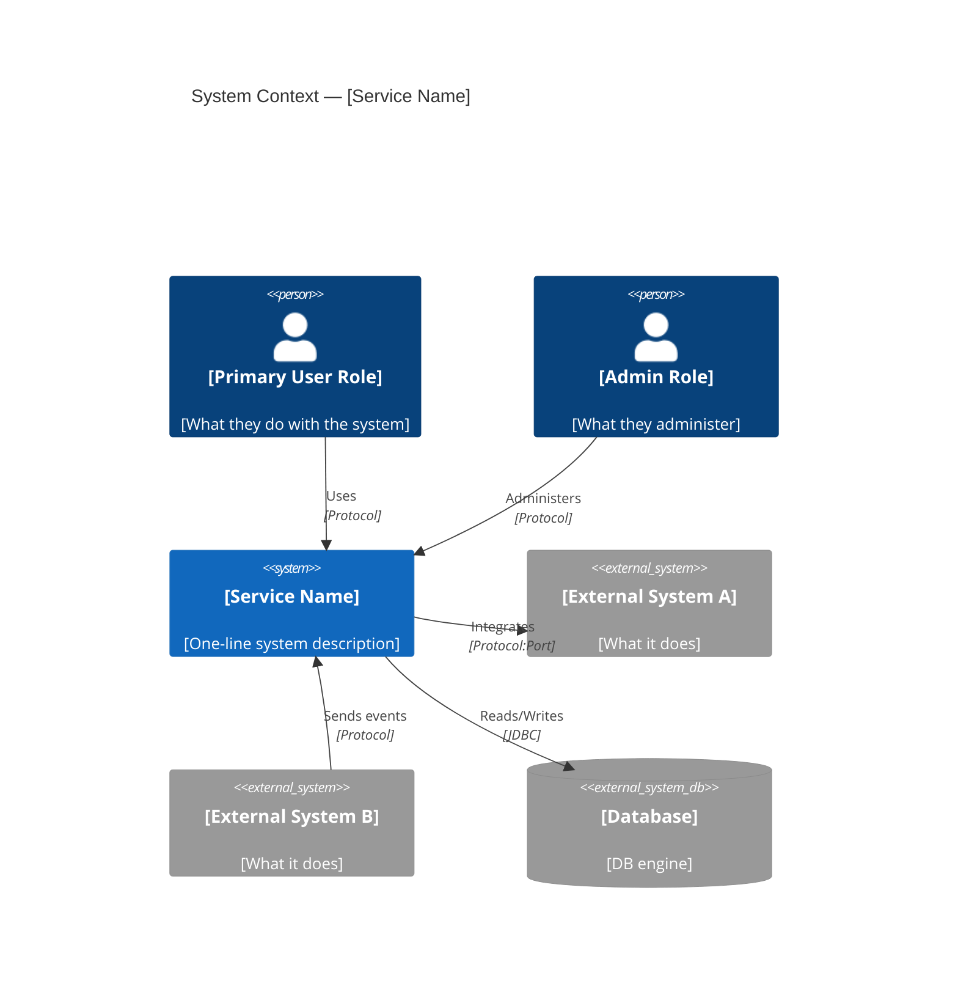
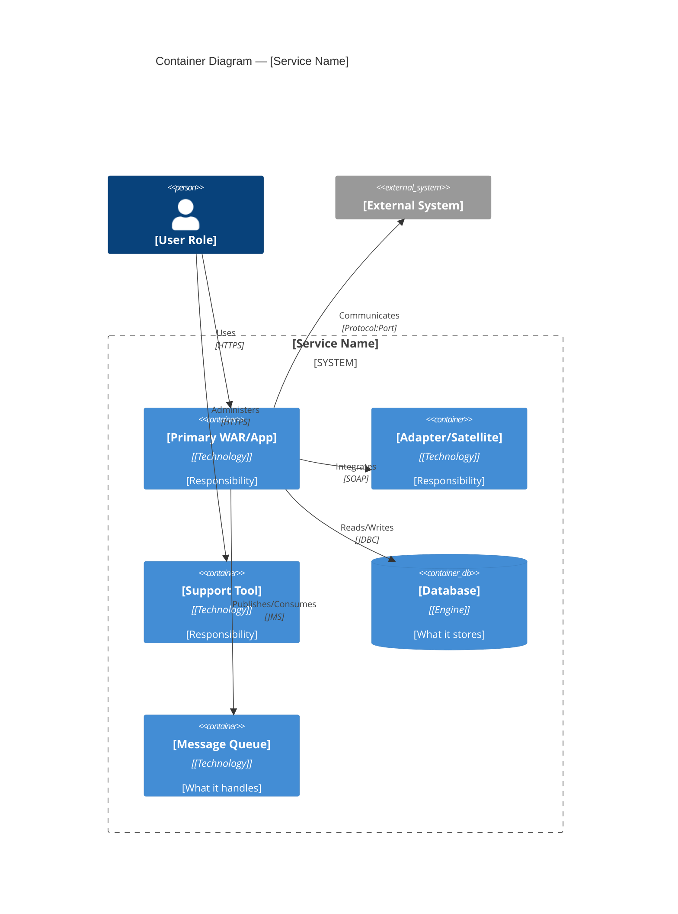
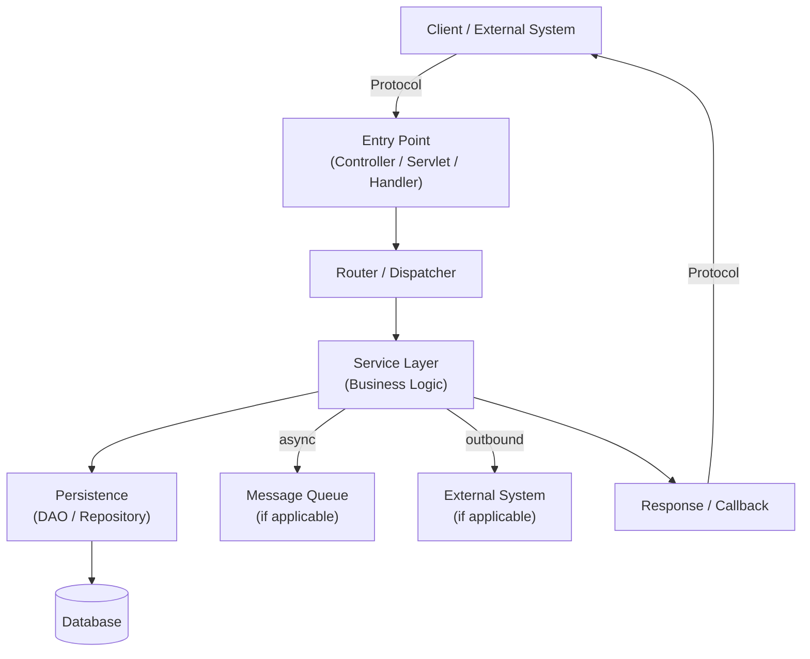

# Reverse Spec 2.0 — Codebase Knowledge Base Generator

## Purpose

Analyze a brownfield codebase and produce a **structured knowledge base** that enables
AI agents to perform Spec-Driven Development with full context. The output is a `docs/`
folder containing technology, deployment, patterns, schema, functional, and architecture
specifications — all evidence-based, all interlinked.

This single command replaces the previous individual commands:
`reverse-stack` · `reverse-deployment` · `reverse-patterns` · `reverse-spec` · `reverse-arch`

---

## Execution Environment

This command is designed to be portable across:
- **Claude Code** (CLI agent with filesystem access)
- **Cursor / AI IDE** (workspace-aware, file context)
- **Any LLM agent** with repo filesystem access

The command reads the workspace root and operates relative to it.

---

## Command Syntax

### Full Scan (Baseline)
```
/reverse-spec-2.0                              → Full run (all phases, interactive)
/reverse-spec-2.0 phase:<phase-name>           → Run a single phase
/reverse-spec-2.0 skip-questions               → Full run, assume defaults
/reverse-spec-2.0 refresh phase:<phase-name>   → Re-run one phase from scratch, preserve others
```

### Incremental Scan (Update)
```
/reverse-spec-2.0 incremental files:<path,path,...>          → Scan specific changed files
/reverse-spec-2.0 incremental modules:<module,module,...>    → Scan specific changed modules
/reverse-spec-2.0 incremental directory:<path>               → Scan all files in a directory
/reverse-spec-2.0 incremental files:<paths> dry-run          → Preview what would change (no writes)
```

### Utilities
```
/reverse-spec-2.0 validate                     → Validate existing docs/ against code
/reverse-spec-2.0 gaps                         → Identify missing coverage in existing docs/
/reverse-spec-2.0 status                       → Show scan history and doc freshness
```

**Available phases:**
`discovery` · `stack` · `deployment` · `patterns` · `schema` · `functional` · `architecture`

---

## Output Structure

All outputs go into `docs/` at the workspace root:

```
docs/
├── .reverse-spec.yml              # Discovery config (persisted for re-runs)
├── discovery/
│   └── DISCOVERY.md               # Tech detection + scope decisions
├── stack/
│   └── STACK.md                   # Technology stack baseline
├── deployment/
│   └── DEPLOYMENT.md              # Deployment topology + service model
├── patterns/
│   └── PATTERNS.md                # Design patterns baseline
├── schema/
│   └── SCHEMA.md                  # Database schema baseline (NEW)
├── functional/
│   ├── PRD-[service-name].md      # System-level PRD (product view)
│   └── features/                  # Feature-level functional constitutions
│       └── [feature]/
│           └── [module]/
│               └── [sub-module].md
└── architecture/
    └── TSD-[service-name].md      # Technical specification (assembled)
```

---

## Security Rules (ALL Phases)

- **NEVER** output passwords, tokens, private keys, encrypted strings, certificates, keystore contents.
- Replace sensitive values with **REDACTED**.
- Never copy full config lines that include credentials — quote only safe parts.
- Do not expose internal hostnames, IPs, or environment-specific URLs unless already public.

---

# Phase 0 — Discovery (Interactive Questionnaire)

## Purpose
Before scanning anything, gather context from the user to scope the analysis correctly.
This avoids wasting effort on obsolete code, test fixtures, or generated artifacts.

## Process

### Step 0.1 — Auto-detect Technology Stack

Scan the workspace root (top 2 levels only) for technology signals:

| Signal                 | Detection Method                                                    |
|------------------------|---------------------------------------------------------------------|
| **Java/Maven**         | `pom.xml` at root                                                   |
| **Java/Gradle**        | `build.gradle` or `build.gradle.kts` at root                        |
| **.NET/C#**            | `*.sln` or `*.csproj` files                                         |
| **Node.js/TypeScript** | `package.json` at root                                              |
| **Python**             | `pyproject.toml`, `setup.py`, `requirements.txt`                    |
| **Go**                 | `go.mod` at root                                                    |
| **Rust**               | `Cargo.toml` at root                                                |
| **Multi-language**     | Multiple signals detected — ask user for primary                    |
| **Monorepo**           | `nx.json`, `lerna.json`, `pnpm-workspace.yaml`, or workspace config |

Also detect:
- **Build system**: Maven, Gradle, MSBuild, npm, yarn, pnpm, pip, cargo
- **CI/CD**: `.gitlab-ci.yml`, `Jenkinsfile`, `.github/workflows/`, `azure-pipelines.yml`, `.circleci/`
- **Containerization**: `Dockerfile`, `docker-compose.yml`, `k8s/`, `helm/`
- **IaC**: `terraform/`, `cdk.json`, `serverless.yml`, `cloudformation/`
- **Database signals**: SQL migration folders, ORM config, schema files, `prisma/`, `drizzle/`

### Step 0.2 — Present Findings & Ask Clarifying Questions

Present the auto-detection results, then ask the following questions.
Use numbered questions grouped by category. Provide A/B/C options where possible.

#### A. Scope & Boundaries

1. **Service name**: What should we call this system? (Used in filenames: `PRD-[name].md`, `TSD-[name].md`)
   - Suggest a default based on repo name or `pom.xml` `<artifactId>` / `package.json` `name`.

2. **Obsolete/dead code**: Are there any folders, modules, or projects that are obsolete, deprecated, or should be excluded from analysis?
   - List all top-level folders/modules detected and ask which to exclude.
   - Example: "I found these modules: `core/`, `legacy-api/`, `tools/`, `simulator/`. Should I exclude any?"

3. **Generated code**: Are there folders containing auto-generated code (Swagger codegen, protobuf output, JAXB, etc.)?
   - These will be noted but not analyzed for patterns.

4. **Multi-module scope**: If monorepo or multi-module, should I document:
   A. The entire repo as one system
   B. A specific module/service only
   C. Each module separately (will produce multiple doc sets)

#### B. Database & Schema

5. **Database access**: How can I access the schema?
   A. SQL migration files exist in the repo (Flyway, Liquibase, Alembic, Prisma, EF Migrations, etc.)
   B. ORM entity/model classes define the schema (JPA, Hibernate, EF Core, Mongoose, Prisma, SQLAlchemy, etc.)
   C. Schema SQL files exist (CREATE TABLE scripts)
   D. I'll provide a database connection or schema dump
   E. No database — skip schema phase
   F. Multiple databases — specify which

6. **Database type(s)**:
   A. Relational (PostgreSQL, MySQL, SQL Server, Oracle, SQLite)
   B. Document (MongoDB, DynamoDB, CosmosDB, Firestore)
   C. Key-value / Cache (Redis, Memcached)
   D. Search (Elasticsearch, OpenSearch)
   E. Multiple — specify

7. **Schema sensitivity**: Are there any tables/collections that contain highly sensitive data that should be flagged (PII, PHI, financial)?

#### C. Runtime & Environment

8. **Target environments**: What environments exist?
   A. Local dev only
   B. Dev + Staging + Production
   C. Multiple production environments (multi-tenant, regional)
   D. Unknown — document what config suggests

9. **Current deployment**: How is this deployed today?
   A. Bare metal / VM
   B. Containers (Docker/Kubernetes)
   C. Serverless (Lambda, Functions)
   D. PaaS (App Service, Elastic Beanstalk, Heroku)
   E. Hybrid — specify
   F. Unknown — let me infer from code

#### D. Documentation Goals

10. **Audience**: Who will consume this knowledge base?
    A. AI agents only (optimize for machine consumption)
    B. Human developers + AI agents (balanced)
    C. Primarily human readers (optimize for readability)

11. **Existing documentation**: Is there existing documentation I should incorporate or cross-reference?
    A. Yes — specify location (wiki, Confluence, README, etc.)
    B. No existing docs
    C. Outdated docs exist — note but don't trust

### Step 0.3 — Produce Discovery Config

After answers, generate `docs/.reverse-spec.yml`:

```yaml
# Reverse Spec 2.0 — Discovery Configuration
# Generated: [date]
# Re-run with: /reverse-spec-2.0 (will reuse this config)

service_name: [name]
workspace_root: [path]

technology:
  primary_language: [language]
  build_system: [build tool]
  runtime: [runtime/server]
  detected_frameworks: [list]

scope:
  include_modules: [list]
  exclude_modules: [list]
  exclude_paths: [list of glob patterns]
  generated_code_paths: [list]

database:
  type: [sql|nosql|both|none]
  engines: [list]
  schema_source: [migrations|orm|sql_files|dump|none]
  migration_tool: [flyway|liquibase|prisma|ef|alembic|none|unknown]
  migration_path: [path]
  sensitive_tables: [list]

deployment:
  model: [vm|container|serverless|paas|hybrid|unknown]
  environments: [list]
  ci_cd: [tool]
  containerized: [true|false]

documentation:
  audience: [ai|hybrid|human]
  existing_docs: [path or none]

phases_completed: []

scan_history:
  last_full_scan: null            # ISO timestamp of last full scan
  last_incremental: null          # ISO timestamp of last incremental
  baseline_commit: null           # Git SHA at time of full scan (if git repo)
  incremental_runs: []            # Log of incremental scans
  # Each entry:
  # - timestamp: "2026-02-12T10:30:00Z"
  #   trigger: "manual"
  #   input: ["src/main/java/com/example/OrderService.java", "src/main/resources/db/migration/V5__add_status.sql"]
  #   phases_affected: [patterns, schema, functional]
  #   sections_updated: ["PATTERNS.md#2.3-strategy", "SCHEMA.md#orders", "PRD.md#FR-12"]
  #   new_entities_added: ["SCHEMA.md#order_audit_log"]
```
```
```

Also generate `docs/discovery/DISCOVERY.md` documenting the detection results and user decisions.

**After producing the config: STOP and confirm with user before proceeding to Phase 1.**

---

# Phase 1 — Stack Baseline

## Role
Act as a **Senior Technical Analyst**. Generate a factual technology stack baseline.

## Input Priority
1. Discovery config (`docs/.reverse-spec.yml`) — for scope and exclusions
2. Build files (pom.xml, package.json, *.csproj, Cargo.toml, go.mod, etc.)
3. Runtime configs (application.yml, context.xml, web.xml, .env.example, etc.)
4. CI/CD configs
5. Installer/deployment scripts

## Scanning Strategy (Technology-Adaptive)

The scanning approach adapts based on the detected technology:

### Java/Maven Projects
- Root `pom.xml` and all module `pom.xml` files
- `<properties>` for version management
- `<dependencies>` and `<dependencyManagement>`
- `<plugins>` for build/packaging info
- `<packaging>` type (war/jar/ear)
- Spring Boot `application*.properties` / `application*.yml`
- Tomcat/Jetty config files

### .NET/C# Projects
- `*.csproj` for NuGet dependencies and target framework
- `*.sln` for project structure
- `appsettings*.json` for configuration
- `Program.cs` / `Startup.cs` for middleware and DI
- `launchSettings.json` for runtime config

### Node.js/TypeScript Projects
- `package.json` for dependencies and scripts
- `tsconfig.json` for TypeScript configuration
- Framework configs (next.config.js, nuxt.config.ts, vite.config.ts, etc.)
- `.env.example` for environment variables

### Python Projects
- `pyproject.toml`, `setup.py`, `setup.cfg`, `requirements*.txt`
- Framework configs (Django settings, Flask config, FastAPI)
- `alembic.ini`, `migrations/` for DB migrations

### Go Projects
- `go.mod` for dependencies
- `go.sum` for locked versions
- `cmd/` and `internal/` for project structure

### Rust Projects
- `Cargo.toml` and `Cargo.lock`
- Workspace members for multi-crate projects

## Output
**File:** `docs/stack/STACK.md`

### STACK.md Structure

```markdown
# [Service Name] — Technology Stack Baseline

## 1) Build & Packaging

### 1.1 Build System
- Tool:
- Evidence: `[file]:[line or tag]`

### 1.2 Language & Runtime
- Language + version:
- Runtime target:
- Evidence:

### 1.3 Module Layout
| Module | Purpose | Key Packages/Files | Evidence |
|--------|---------|-------------------|----------|

### 1.4 Deployable Artifacts
| Artifact | Packaging | Producing Module | Output Path | Evidence |
|----------|-----------|-----------------|-------------|----------|

## 2) Core Frameworks & Libraries

| Area | Technology | Version | Evidence |
|------|-----------|---------|----------|
| DI / Core | | | |
| Web / MVC | | | |
| API (REST/GraphQL/gRPC) | | | |
| Persistence / ORM | | | |
| Scheduling | | | |
| Messaging | | | |
| Logging | | | |
| Security / Auth | | | |
| Testing | | | |
| Utilities | | | |

## 3) Data & Storage

### 3.1 Databases
- Runtime DBs (from config):
- Drivers/clients (from dependencies):
- Evidence:

### 3.2 Connection Strategy
- Connection method (JNDI / connection string / env var):
- Pooling:
- Evidence:

### 3.3 Migration Tool
- Tool:
- Evidence:

## 4) Runtime Environment

### 4.1 App Server / Container
- Type:
- Evidence:

### 4.2 Configuration Strategy
- Sources (JNDI, property files, env vars, secrets manager):
- Evidence:

### 4.3 External Dependencies
| Dependency | Type | Config Key(s) | Evidence |
|-----------|------|--------------|----------|

## 5) Observability
- Logging framework + config:
- Metrics/tracing:
- Evidence:

## 6) Gaps / Open Questions
| Item | Missing Evidence |
|------|-----------------|
```

---

# Phase 2 — Deployment Baseline

## Role
Act as a **Senior Infrastructure Analyst**. Describe how the system is deployed and runs today.

## Input Priority
1. Discovery config
2. STACK.md (from Phase 1)
3. Packaging evidence (build files, Dockerfile, k8s manifests, Helm charts)
4. Runtime configs (server config, startup scripts, service wrappers)
5. CI/CD pipelines
6. IaC files (Terraform, CDK, CloudFormation)

## Scanning Strategy (Technology-Adaptive)

### Traditional / VM Deployment
- WAR/EAR packaging, app server configs
- Service wrappers (systemd, Windows services, procrun, winsw)
- Installer scripts (InstallAnywhere, NSIS, MSI)
- Startup scripts (*.sh, *.bat, *.cmd, *.ps1)

### Container Deployment
- Dockerfile(s) — base images, exposed ports, entrypoints
- docker-compose.yml — service definitions, networks, volumes
- Kubernetes manifests (Deployment, Service, ConfigMap, Secret, Ingress)
- Helm charts (values.yaml, templates)

### Serverless Deployment
- serverless.yml, SAM templates, CDK constructs
- Lambda/Function handler configs
- API Gateway definitions

### PaaS Deployment
- Procfile, app.yaml, Elastic Beanstalk configs
- Platform-specific deployment configs

## Output
**File:** `docs/deployment/DEPLOYMENT.md`

### DEPLOYMENT.md Structure

```markdown
# [Service Name] — Deployment Baseline

## 1) Deployable Units
### Unit: [name]
- Type (WAR/JAR/Container/Lambda/Binary):
- Produced by module:
- How started:
- Process model (JVM count, container replicas):
- Ports (HTTP/HTTPS + non-HTTP):
- Evidence:

## 2) Runtime Topology

### 2.1 Process Model
- Single vs multi-process:
- Container orchestration (if any):
- Evidence:

### 2.2 Host/OS Assumptions
- OS signals (Windows/Linux/Container):
- File paths used:
- Evidence:

### 2.3 Networking
- HTTP/HTTPS ports:
- Non-HTTP ports (protocols, listeners):
- Load balancer / reverse proxy (if detected):
- Evidence:

## 3) Configuration at Runtime

### 3.1 Data Sources
| Name/Key | DB Type | Connection Info (safe) | Evidence |
|----------|---------|----------------------|----------|

### 3.2 Environment Configuration
| Key | Purpose | Category | Evidence |
|-----|---------|----------|----------|
Categories: scheduling, security, file-paths, integration-endpoints, feature-flags, limits

## 4) Data & State
- Shared vs separated schemas:
- Shared filesystem paths:
- Session/state handling:
- Cache layer (if any):
- Evidence:

## 5) Communication & Integration
| Channel | Type | Direction | Endpoint/Topic | Evidence |
|---------|------|-----------|---------------|----------|
Types: REST, SOAP, gRPC, GraphQL, WebSocket, JMS, AMQP, MQTT, Kafka, FTP, SMTP

### 5.1 Integration Diagram

**Purpose:** Visual baseline of all communication channels for architect-agent consumption. The architect-agent copies this diagram and annotates it with new/modified integration paths for each user story.

**Instructions:** Generate a Mermaid flowchart showing all detected integration channels from the table above. Group by protocol type. Include port numbers and direction arrows.



**Generation Rules:**
- One node per external system or integration endpoint
- Edge labels must include protocol and port
- Bidirectional channels use `<-->`, unidirectional use `-->`
- Group the system's internal components by function (API, messaging, hardware, storage)
- Evidence: cite the config file or code that proves each channel

## 6) Service Model Classification

| Dimension | Monolith Signal | Microservice Signal | Current State | Evidence |
|-----------|----------------|-------------------|---------------|----------|
| Deployability | One unit released together | Independent services | | |
| Runtime isolation | Same process/container | Separate runtimes | | |
| Data ownership | Shared schema | DB per service | | |
| Communication | In-process calls | Network contracts | | |
| Scaling | Scale whole app | Scale per service | | |
| Team ownership | Single team | Team per service | | |

### Conclusion
- **Model today**: Monolith / Modular Monolith / Distributed Monolith / Microservices
- **Why** (bullets with evidence):
- **Constraints** (what prevents independent deploy/scale):
- **Open questions**:
```

---

# Phase 3 — Patterns Baseline

## Role
Act as a **Senior Software Architect**. Identify design patterns with proof. No pattern without evidence.

## Input Priority
1. Discovery config
2. STACK.md (frameworks determine expected patterns)
3. Source code — entry points, core wiring, persistence, cross-cutting, scheduling, messaging

## Scanning Strategy (Technology-Adaptive)

### Java / Spring
- Spring XML configs, `@Component`, `@Service`, `@Repository`, `@Controller`
- Struts actions, CXF endpoints (JAX-WS, JAX-RS)
- Hibernate/JPA session usage, DAOs
- AOP, interceptors, filters
- Quartz jobs, `@Scheduled`
- JMS listeners, ActiveMQ/Kafka producers

### .NET / ASP.NET
- Controllers, Minimal API endpoints
- Dependency injection in `Program.cs` / `Startup.cs`
- Entity Framework DbContext, repositories
- MediatR / CQRS patterns
- Middleware pipeline
- Background services, Hangfire jobs
- SignalR hubs

### Node.js / TypeScript
- Express/Fastify/NestJS route handlers
- Middleware chains
- Repository/service patterns
- Event emitters, message queue consumers
- Cron jobs (node-cron, Bull queues)
- Prisma/TypeORM/Mongoose models

### Python
- Django views/viewsets, Flask routes, FastAPI endpoints
- Django ORM / SQLAlchemy models
- Celery tasks
- Middleware
- Signal handlers

## Output
**File:** `docs/patterns/PATTERNS.md`

### PATTERNS.md Structure

```markdown
# [Service Name] — Design Patterns Baseline

## 1) Framework Patterns (prove each)

### 1.1 Web / API Pattern
- Pattern:
- Where used:
- Evidence:

### 1.2 Dependency Injection
- Pattern:
- Evidence:

### 1.3 Data Access Pattern
- Pattern (DAO/Repository/Active Record/Query Builder):
- Evidence:

## 2) Intentional Design Patterns (proof required)

For each pattern:
### Pattern: [Name] (Confidence: High/Medium/Low)
- Intent (1 line):
- Evidence:
  - Class(es)/File(s):
  - Interface(s):
  - Call sites:
  - Wiring/config:
- Why it qualifies (2–4 bullets):

> Rule: No class + call site = move to Candidates (Section 5).

## 3) Architectural Patterns

### 3.1 Layering
- Observed layers:
- Evidence (package/folder structure + dependency direction):
- Violations (if any):

### 3.2 Modular Boundaries
| Module | Responsibility | Key Interfaces | Coupling Hotspots |
|--------|---------------|----------------|-------------------|

### 3.3 Module Dependency Diagram

**Purpose:** Visual baseline of module dependencies for architect-agent consumption. The architect-agent copies this diagram and marks modules as `<<NEW>>` or `<<MODIFIED>>` for each user story.

**Instructions:** Generate a Mermaid flowchart showing module dependencies based on evidence from build files (imports, POM dependencies, package references) and runtime wiring (DI config, bean imports).



**Generation Rules:**
- One node per module/project/package detected in §3.2 Modular Boundaries table
- Arrows represent compile-time or runtime dependencies (direction = "depends on")
- Label arrows only if the dependency type is non-obvious
- Highlight coupling hotspots (modules with 4+ incoming dependencies) with a note
- Evidence: cite POM dependency, import statement, or DI wiring file for each arrow

### 3.4 Component Ownership Map (Optional)

**Purpose:** Map modules/components to their owners (teams, individuals) when ownership information is discoverable from the codebase. This feeds the "Owner / Team" column in the architect-agent's IMPACT-ANALYSIS.md consolidated impact register.

**Extract ownership from (in priority order):**
1. `CODEOWNERS` file (GitHub/GitLab)
2. `pom.xml` `<developers>` / `<organization>` sections (Maven projects)
3. `package.json` `author` / `contributors` fields (Node.js projects)
4. Module/package naming conventions (e.g., `com.company.team.module`)
5. Git blame / commit frequency per directory (most frequent committer = likely owner)

| Module / Component | Owner / Team | Evidence | Confidence |
|-------------------|-------------|----------|------------|
| [module-name] | [team or individual] | [CODEOWNERS line / pom.xml section / etc.] | High / Medium / Low |

**Generation rules:**
- Only include if ownership data is actually discoverable — do not guess
- If no ownership data found, omit this section entirely (do not generate empty tables)
- Mark confidence: High = explicit CODEOWNERS / metadata, Medium = naming convention, Low = git history inference
- One row per module listed in the Module Dependency Diagram (§3.3)

### 3.5 Integration Patterns
| Pattern | Type | Evidence |
|---------|------|----------|
Types: SOAP, REST, gRPC, GraphQL, Messaging, Callback, Webhook, File-based

## 4) Cross-Cutting Patterns

### 4.1 Transaction Management
- Approach:
- Evidence:

### 4.2 Error Handling
- Approach:
- Evidence:

### 4.3 Scheduling / Background Jobs
- Framework:
- Jobs:
- Evidence:

### 4.4 Authentication & Authorization
- Approach:
- Evidence:

### 4.5 Caching
- Approach:
- Evidence:

## 5) Candidates (unconfirmed)
| Candidate Pattern | Why Suspected | Missing Evidence |
|-------------------|--------------|-----------------|
```

---

# Phase 4 — Schema Baseline (NEW)

## Role
Act as a **Senior Data Architect**. Document the database schema as a knowledge base for AI agents.

## Purpose
Capture the data model so that AI agents understand entities, relationships, constraints,
and data semantics when generating or modifying code.

## Input Priority
1. Discovery config (DB type, schema source, sensitive tables)
2. STACK.md (DB engines, drivers, ORM)
3. Schema source (as determined in discovery):
   - Migration files (Flyway, Liquibase, Prisma, EF Migrations, Alembic, etc.)
   - ORM entity classes (JPA, Hibernate, EF Core, Mongoose, Prisma, SQLAlchemy, Django, etc.)
   - SQL DDL files (CREATE TABLE scripts)
   - Schema dump (provided by user)

## Scanning Strategy

### SQL / Relational Databases

#### From Migration Files
- Scan migration files **in order** (version/timestamp)
- Track cumulative schema: CREATE, ALTER, DROP
- Capture: tables, columns, types, constraints (PK, FK, UNIQUE, CHECK, NOT NULL)
- Capture: indexes, default values, enums/lookup tables

#### From ORM Entities
- **JPA/Hibernate**: `@Entity`, `@Table`, `@Column`, `@Id`, `@ManyToOne`, `@OneToMany`, `@JoinColumn`, `@Enumerated`, `@Embedded`
- **EF Core**: `DbSet<>`, `[Key]`, `[Required]`, `[MaxLength]`, `[ForeignKey]`, Fluent API in `OnModelCreating`
- **Prisma**: `schema.prisma` model definitions
- **SQLAlchemy**: `Column()`, `relationship()`, `ForeignKey()`, model classes
- **Django**: `models.Model` subclasses, field definitions
- **TypeORM**: `@Entity`, `@Column`, `@PrimaryGeneratedColumn`, `@ManyToOne`, `@JoinColumn`

#### From SQL DDL
- Parse CREATE TABLE, ALTER TABLE, CREATE INDEX statements
- Capture all constraints and relationships

### NoSQL / Document Databases

#### MongoDB (via Mongoose or direct)
- **Mongoose**: Schema definitions, validators, indexes, virtuals, discriminators
- **Direct**: Collection naming conventions, sample documents (if schema dump provided)

#### DynamoDB
- Table definitions (partition key, sort key, GSI, LSI)
- From CDK/CloudFormation/Terraform definitions
- From SDK usage patterns in code

#### CosmosDB / Firestore
- Container/collection definitions from IaC or SDK usage
- Partition key strategies

### Mixed / Multiple Databases
- Document each database separately under its own section
- Cross-reference where data flows between databases

## Output
**File:** `docs/schema/SCHEMA.md`

### SCHEMA.md Structure

```markdown
# [Service Name] — Database Schema Baseline

## 1) Schema Overview

### 1.1 Database Inventory
| Database | Engine | Purpose | Schema Source | Evidence |
|----------|--------|---------|-------------|----------|

### 1.2 Schema Statistics
- Total tables/collections: [n]
- Total relationships: [n]
- Migration tool: [tool]
- Latest migration: [version/timestamp]

## 2) Entity Catalog

For each table/collection:

### [Entity Name] (`table_name` / `collection_name`)

**Purpose:** [1–2 sentences: what this entity represents and why it exists]

**Sensitivity:** [None / Contains PII / Contains PHI / Contains Financial Data]

#### Attributes
| Column/Field | Type | Nullable | Default | Constraints | Purpose |
|-------------|------|----------|---------|-------------|---------|

#### Keys & Indexes
| Name | Type (PK/FK/Unique/Index) | Columns | References | Evidence |
|------|--------------------------|---------|-----------|----------|

#### Relationships
| Relationship | Target Entity | Type (1:1/1:N/M:N) | FK Column | Evidence |
|-------------|--------------|---------------------|-----------|----------|

#### Source Evidence
- Migration: `[file:version]`
- ORM Entity: `[file:class]`
- DDL: `[file:line]`

## 3) Relationship Map

**Purpose:** Visual baseline of all entity relationships for architect-agent consumption. The architect-agent copies this diagram and creates a "delta ER" showing new/modified entities for each user story.

**Instructions:** Generate a Mermaid erDiagram showing all entities from §2 Entity Catalog with their relationships. For large schemas (20+ entities), split into domain clusters with a separate diagram per cluster and a summary diagram showing inter-cluster relationships.

### 3.1 Full ER Diagram (or Summary if split)



### 3.2 Domain Cluster Diagrams (If Schema > 20 Entities)

Split the ER diagram into logical domain clusters. Each cluster gets its own diagram:

**Cluster naming convention:** `[DomainName] Domain` (e.g., "Access Control Domain", "Configuration Domain", "Logging Domain")

For each cluster:


**Generation Rules:**
- Include ALL entities from §2 Entity Catalog — no entity omitted
- Each entity shows: PK field, FK fields, and up to 5 key business fields
- Relationship labels describe the business meaning (not just "has" or "references")
- For schemas with 20+ entities, split into domain clusters and add cross-cluster references as comments
- Sensitive entities (marked in §2) should include a comment: `%% SENSITIVE: Contains [PII/PHI/Financial]`
- Evidence: every entity references its source in §2

### 3.3 Relationship Summary Table

Retain a compact text summary alongside the diagram for quick reference:

| Parent Entity | Relationship | Child Entity | FK Column | Type |
|--------------|-------------|-------------|-----------|------|
| [Entity A] | has many | [Entity B] | fk_column | 1:N |
| [Entity A] | many-to-many | [Entity C] | join_table | M:N |

## 4) Enums, Lookups & Reference Data
| Name | Type (Enum/Lookup Table/Constants) | Values | Used By | Evidence |
|------|-----------------------------------|--------|---------|----------|

## 5) Data Constraints & Business Rules (Schema-Level)
| Constraint | Table(s) | Type | Rule | Evidence |
|-----------|----------|------|------|----------|
Types: CHECK, UNIQUE, NOT NULL composite, Trigger, Custom

## 6) Schema Patterns Observed
- Soft deletes (deleted_at, is_active):
- Audit columns (created_at, updated_at, created_by):
- Multi-tenancy (tenant_id):
- Versioning/optimistic locking (version column):
- Polymorphism (discriminator columns):
- Evidence for each:

## 7) Gaps & Open Questions
| Item | What's Missing | Impact |
|------|---------------|--------|
```

---

# Phase 5 — Functional Baseline

## Role
Act as a **Senior Product-minded Technical Architect**. Document what users can do today.

## Input Priority
1. Discovery config
2. PATTERNS.md (API surfaces, entry points, flows)
3. DEPLOYMENT.md (runtime constraints: schedules, limits, ports)
4. STACK.md (tech choices that impact behavior)
5. SCHEMA.md (entities, constraints, state machines)
6. Source code: controllers/endpoints, service layer, validators, tests, DB schema

## Process

### Step 5.1 — Generate System-Level PRD

Produce `docs/functional/PRD-[service-name].md` covering the full system.

This is a **multi-turn step**. Before generating the PRD:

1. Present a summary of discovered capabilities.
2. Categorize findings: **Verified** / **Needs Confirmation** / **Assumed**.
3. Ask 5–12 clarifying questions (grouped by A. Scope, B. Intent, C. Accuracy).
4. **STOP and wait for answers** (unless user said `skip-questions`).

### PRD Structure

```markdown
# PRD — [Service Name]

## 1) System Summary
[1–2 paragraphs: what the system is and its primary purpose]

## 2) Users, Roles & Permissions
| Role | Capabilities | Permission Boundaries | Evidence |
|------|-------------|----------------------|----------|

## 3) Functional Requirements
Grouped by feature area. Numbered: FR-1, FR-2, …

### [Feature Area]
- **FR-N**: [Behavior and expected outcome]
  - Evidence: `[file:identifier]`

## 4) Key Workflows
3–8 workflows, step-by-step. Include alternate/error paths.

### Workflow: [Name]
```
1. [Actor] does [action]
2. System [response]
3. …
Result: [outcome]
```

## 5) Business Rules
- **BR-N**: [Rule in plain English]
  - Evidence: `[file:line]`

## 6) User-Facing Constraints
| Constraint | Type | Value | Evidence |
|-----------|------|-------|----------|
Types: Schedule, Limit, Timeout, Concurrency, Feature Flag

## 7) Integrations
| Name | Type | Direction | Purpose | Evidence |
|------|------|-----------|---------|----------|

## 8) Edge Cases & Error Handling
| Scenario | System Response | Evidence |
|----------|----------------|----------|

## 9) Assumptions & Open Questions
### Assumptions
| Assumption | Reason | Missing Evidence |
|-----------|--------|-----------------|

### Needs Confirmation
| Item | Conflicting Evidence | Resolution Needed |
|------|---------------------|-------------------|
```

### Step 5.2 — Generate Feature-Level Functional Constitutions (Optional)

If the codebase is large enough (5+ distinct feature areas), also generate
feature-level specs in `docs/functional/features/`.

Use the Feature → Module → Sub-module hierarchy:
```
docs/functional/features/
├── [feature-name]/
│   └── [module-name]/
│       └── [sub-module-name].md
```

Each sub-module file follows the Functional Constitution Template:

```markdown
# [Sub-Module Name]

## Purpose
[1–2 sentences]

## Scope
**In Scope:** [list]
**Out of Scope:** [list]

## Business Rules
### [Category]
- **BR-1**: [Rule]
  - *Source*: `[file:line]`
  - *Test*: `[TestMethodName]` or ⚠ No test found

## Functional Requirements
### FR-1: [Name]
| Field | Detail |
|-------|--------|
| Trigger | [action/event] |
| Input | [data] |
| Output | [result] |

**Process:** [numbered steps]
**Error Conditions:** [table]

## Validation Rules
- **VR-1**: [Rule]
  - *Source*: `[file:line]`
  - *Constraint*: [details]

## User Workflows
### [Scenario Name]
[numbered steps with result]

## State Transitions (if applicable)
| From | Trigger | To | Rules |
|------|---------|-----|-------|

## Integration Points
| System | Interface | Purpose |
|--------|-----------|---------|

## Edge Cases
- **EC-1**: [Scenario]
  - *Handling*: [response]
  - *Source*: `[file:line]`

## Open Questions
- [ ] [Question]

## Related Specifications
- [Link](../relative/path.md) — [relationship]

---
**Metadata**
| Field | Value |
|-------|-------|
| Extracted From | `[files]` |
| Extraction Date | [date] |
| Test Coverage | [x]% ([y]/[z] rules have tests) |
| Coverage Gaps | [list or "None"] |
```

---

# Phase 6 — Architecture Assembly (TSD)

## Role
Act as a **Senior Technical Architect**. Assemble the final Technical Specification Document.

## Input Priority (Assembly Step — Do NOT Re-scan)
1. `docs/stack/STACK.md`
2. `docs/deployment/DEPLOYMENT.md`
3. `docs/patterns/PATTERNS.md`
4. `docs/schema/SCHEMA.md`
5. `docs/functional/PRD-[service-name].md`

## Process

### Step 6.1 — Consistency Check (Silent)
Before writing, validate:
- Versions do not conflict across documents
- Deployable units match modules
- Ports, DBs, queues, endpoints are consistent
- Schema entities align with ORM/persistence references

If conflicts exist, document both values and mark as **Needs Confirmation**.

### Step 6.2 — Generate TSD

**File:** `docs/architecture/TSD-[service-name].md`

```markdown
# TSD — [Service Name]

## 1) Service Overview
- **Name:**
- **Purpose:**
- **Primary responsibilities:**
- **In-scope capabilities:** (from PRD)
- **Out-of-scope:** (from PRD or `Unknown`)
- **Related components/services:**

## 2) Tech Stack Summary
(From STACK.md — compact table with versions and evidence)

| Area | Technology | Version | Evidence |
|------|-----------|---------|----------|

## 3) Project Structure
(From STACK.md — 2-level tree + module table)

| Module/Folder | Responsibility | Evidence |
|--------------|---------------|----------|

## 4) Deployment & Runtime Topology
(From DEPLOYMENT.md)

### 4.1 Deployable Units
| Unit | Type | Produced By | How Started | Evidence |
|------|------|------------|-------------|----------|

### 4.2 Runtime Topology
- Process model:
- Host/OS assumptions:
- Ports:
- Config sources:
- Secrets handling: REDACTED

### 4.3 Service Model Classification
- **Model today:**
- **Why:**
- **Rubric:** (copy from DEPLOYMENT.md)

## 5) Architecture
(From PATTERNS.md)

### 5.0 System Context Diagram

**Purpose:** Visual baseline of the system and its external actors/systems for architect-agent consumption. The architect-agent copies this diagram and adds new actors or integration paths for each user story with `<<NEW>>` stereotypes.



**Generation Rules:**
- Include ALL actors from PRD §2 (Users, Roles & Permissions)
- Include ALL external systems from DEPLOYMENT.md §5 (Communication & Integration)
- Include ALL databases from DEPLOYMENT.md §3.1 (Data Sources)
- Label relationships with protocol and direction
- Evidence: cross-reference PRD, DEPLOYMENT.md, and PATTERNS.md

### 5.0.1 Container Diagram

**Purpose:** Visual baseline of deployable units and their internal module structure for architect-agent consumption. The architect-agent copies this diagram and marks containers as `<<NEW>>` or `<<MODIFIED>>` for each user story.



**Generation Rules:**
- One container per deployable unit from DEPLOYMENT.md §1 (Deployable Units)
- Show key internal modules only if they represent distinct runtime boundaries
- Include all databases, message brokers, and caches as container nodes
- Relationships must include protocol
- Evidence: cross-reference STACK.md (module layout) and DEPLOYMENT.md (deployable units)

### 5.1 Style & Key Patterns
- Style summary (1 paragraph):
- Key patterns (bullets with evidence):

### 5.2 Representative Request Flow

**Purpose:** Visual baseline of the canonical request path for architect-agent consumption. The architect-agent copies this diagram and shows where a new user story's flow branches from or extends the existing path.



**Generation Rules:**
- Follow the actual request path evidenced in PATTERNS.md §1 (Framework Patterns)
- Include async boundaries (mark with "async" label)
- Include external system calls if they are part of the typical request flow
- Keep it to one canonical "happy path" — the architect-agent will add feature-specific branching
- Evidence: reference PATTERNS.md entry points and DEPLOYMENT.md communication channels

### 5.3 Data Flow
- Datastores and what they store:
- Queue/topic flows:

## 6) Data Model Summary
(From SCHEMA.md — high-level)

### 6.1 Entity Overview
| Entity | Purpose | Key Relationships | Sensitivity |
|--------|---------|------------------|-------------|

### 6.2 Key Schema Patterns
(Soft deletes, audit, multi-tenancy, etc.)

## 7) External Dependencies
| Name | Type | Direction | Purpose | Evidence |
|------|------|-----------|---------|----------|

## 8) Configuration & Environment
### 8.1 Config Sources
(JNDI, property files, env vars, secrets manager)

### 8.2 Key Parameters
| Category | Key | Value (safe) | Evidence |
|----------|-----|-------------|----------|
Categories: Limits, Timeouts, Schedules, Security, File Paths

## 9) Constraints
| Constraint | Evidence |
|-----------|----------|

## 10) Assumptions & Open Questions
### Assumptions
| Assumption | Reason | Missing Evidence |
|-----------|--------|-----------------|

### Needs Confirmation
| Item | Conflicting Evidence | Resolution Needed |
|------|---------------------|-------------------|
```

---

# Cross-Cutting Rules (All Phases)

## Evidence Rules
- Every claim must cite evidence: `path/to/file` + `identifier` (class, method, config key, line number).
- If evidence is missing, mark as `Unknown` and add to Assumptions.
- Never invent features, patterns, or dependencies.

## Documentation Rules
- **No critique.** Document what exists. Do not recommend improvements.
- **No secrets.** REDACTED for all sensitive values.
- **Concise.** Use tables and bullets. Avoid long prose.
- **Interlinked.** Cross-reference between documents where relevant.
  Example: "See [SCHEMA.md](../schema/SCHEMA.md#entity-name) for entity details"

## Diagram Rules (Mermaid Baseline)

All baseline Mermaid diagrams in the knowledge base serve as **foundations for the architect-agent**. Follow these rules:

1. **Evidence-driven generation** — every node and edge in a diagram must have evidence from the scanned codebase. No speculative components.
2. **Complete coverage** — ER diagrams must include ALL entities. System context must include ALL external systems. Integration diagrams must include ALL channels.
3. **Architect-reusable format** — diagrams must use standard Mermaid syntax that the architect-agent can copy and extend. Use comments (`%%`) to mark sections the architect should modify.
4. **Domain clustering** — for schemas with 20+ entities, split into domain clusters to keep diagrams readable.
5. **Incremental update** — when running incremental scans, update affected diagrams by adding/removing nodes and edges. Mark new additions with `%% NEW [date]` comments.
6. **No opinion** — diagrams document what exists, not what should be. No layout preferences, no recommended changes.

## Progress Tracking

After completing each phase, update `docs/.reverse-spec.yml`:
```yaml
phases_completed:
  - discovery: "2026-02-12"
  - stack: "2026-02-12"
  - deployment: "2026-02-12"
  # etc.
```

## Phase Completion Summary

At the end of each phase, print a brief summary:

```
✅ Phase [N] — [Name] Complete
📄 Output: docs/[section]/[FILE].md
📊 Coverage: [key stats]
⚠  Open Questions: [count]
👉 Next: Phase [N+1] — [Name]
```

At the end of the full run, print:

```
═══════════════════════════════════════════════════
✅ Reverse Spec 2.0 — Knowledge Base Complete

📂 Output Structure:
   docs/
   ├── .reverse-spec.yml
   ├── discovery/DISCOVERY.md
   ├── stack/STACK.md
   ├── deployment/DEPLOYMENT.md
   ├── patterns/PATTERNS.md
   ├── schema/SCHEMA.md
   ├── functional/
   │   ├── PRD-[service].md
   │   └── features/...
   └── architecture/TSD-[service].md

📊 Summary
   Frameworks & Libraries  : [n]
   Deployable Units        : [n]
   Design Patterns         : [n] confirmed, [n] candidates
   DB Entities             : [n] tables/collections
   Functional Requirements : [n]
   Business Rules          : [n]
   Integrations            : [n]
   Baseline Diagrams       : [n] mermaid diagrams generated
   Open Questions          : [n] total across all docs

💡 Suggested Next Steps
   1. Review open questions in each document
   2. Validate schema baseline against live database
   3. Use this knowledge base with SDD agents for feature development
═══════════════════════════════════════════════════
```

---

# Full Scan vs Incremental Scan

## Overview

| Mode | When to Use | What Happens | Output |
|------|------------|--------------|--------|
| **Full Scan** | First run, major refactors, periodic re-baseline | Runs all phases end-to-end, produces complete `docs/` | Entire `docs/` folder created/overwritten |
| **Incremental Scan** | Day-to-day changes, new features, bug fixes | User specifies changed files/modules, only affected docs update | In-place section updates + new entities added |
| **Refresh** | Single phase went stale or needs re-run | Re-runs one phase from scratch using latest code | One phase document overwritten |

---

## Full Scan Mode

### Command
```
/reverse-spec-2.0
/reverse-spec-2.0 skip-questions
```

### Behavior
1. Runs Phase 0 (Discovery) — asks questions, produces config
2. Runs Phases 1–6 sequentially
3. Produces complete `docs/` folder
4. Records `last_full_scan` timestamp and `baseline_commit` (if git) in `.reverse-spec.yml`

### When to Use
- **First time** on a codebase (no existing `docs/`)
- **Major refactors** — large-scale module restructuring, framework migration, database redesign
- **Periodic re-baseline** — recommended every 3–6 months or after major releases
- **Drift detected** — when `/reverse-spec-2.0 validate` reports significant drift

### Safeguards
- If `docs/` already exists, warn the user before overwriting
- Offer to back up existing docs to `docs/.backup-[timestamp]/` before full scan
- Always preserve `.reverse-spec.yml` scan history (append, don't replace)

---

## Incremental Scan Mode

### Command Variants
```
/reverse-spec-2.0 incremental files:src/main/java/com/example/OrderService.java,src/main/java/com/example/OrderController.java
/reverse-spec-2.0 incremental modules:order-service,payment-service
/reverse-spec-2.0 incremental directory:src/main/java/com/example/orders/
/reverse-spec-2.0 incremental files:path/to/file.java dry-run
```

### Prerequisites
- `docs/` must exist from a prior full scan
- `docs/.reverse-spec.yml` must be present with valid config
- If prerequisites are not met, prompt: "No existing baseline found. Run a full scan first with `/reverse-spec-2.0`"

### Process

#### Step I-1 — Classify Changed Files

Examine each specified file and classify it into one or more impact categories:

| File Type | Affected Phase(s) | Example |
|-----------|-------------------|---------|
| Build file (pom.xml, package.json, *.csproj) | Stack | New dependency added |
| Deployment config (Dockerfile, k8s, CI/CD) | Deployment | New container, port change |
| Source — Controller/Endpoint | Patterns + Functional | New API endpoint |
| Source — Service/Business logic | Patterns + Functional | New business rule |
| Source — Entity/Model class | Schema + Functional | New field, new entity |
| Source — Repository/DAO | Patterns | Data access pattern change |
| DB Migration file | Schema | New table, altered column |
| Config file (application.yml, context.xml) | Deployment + Stack | New env var, changed limit |
| Test file | Functional | New test coverage for existing rule |
| Cross-cutting (Filter, Interceptor, Middleware) | Patterns | New cross-cutting concern |

**Classification output** (shown to user before proceeding):
```
📂 Analyzing incremental changes...

Files provided: 4
┌─────────────────────────────────────────────────────────┬────────────────┬──────────────────┐
│ File                                                    │ Category       │ Phases Affected  │
├─────────────────────────────────────────────────────────┼────────────────┼──────────────────┤
│ src/main/java/com/example/orders/OrderService.java      │ Service logic  │ Patterns, Func.  │
│ src/main/java/com/example/orders/OrderController.java   │ Endpoint       │ Patterns, Func.  │
│ src/main/java/com/example/orders/model/OrderStatus.java │ Entity/Enum    │ Schema, Func.    │
│ src/main/resources/db/migration/V5__add_audit.sql       │ Migration      │ Schema           │
└─────────────────────────────────────────────────────────┴────────────────┴──────────────────┘

Phases to update: Schema, Patterns, Functional
Documents affected:
  - docs/schema/SCHEMA.md (sections: Entity Catalog, Enums)
  - docs/patterns/PATTERNS.md (sections: Framework Patterns, Architectural Patterns)
  - docs/functional/PRD-[service].md (sections: Functional Requirements, Business Rules)

Proceed with incremental update? [Y/n]
```

#### Step I-2 — Analyze Changed Files

For each affected phase, analyze **only the specified files** but read the **existing doc** for context:

1. **Read the existing phase document** to understand current baseline
2. **Analyze the changed files** for new/modified content
3. **Compare** what's new vs what's already documented
4. **Classify changes** as:

| Change Type | Action |
|-------------|--------|
| **Modified entity** — existing item changed (new field, renamed, updated logic) | Update the existing section in-place |
| **New entity** — entirely new table, endpoint, pattern, rule not in docs | **Add automatically** as new section with `🆕` marker |
| **Removed entity** — item exists in docs but code reference is gone | Mark as `⚠️ Possibly removed` (do NOT auto-delete) |
| **No change** — file analyzed but content matches existing docs | Skip, no update |

#### Step I-3 — Update Documents In-Place

For each affected document, apply surgical updates:

**Update rules:**
- **Overwrite only the affected sections.** Do not rewrite unaffected sections.
- **Preserve existing evidence references** for unchanged items.
- **New entities get added** in the correct location within the document (alphabetically or logically grouped).
- **Mark new additions** with `🆕 Added [date]` on the first incremental run. Remove the marker on next full scan.
- **Mark suspected removals** with `⚠️ Possibly removed — not found in [file]. Verify before deleting.`
- **Update the metadata** at the bottom of each modified document:

```markdown
---
*Last full scan: [date]*
*Last incremental update: [date]*
*Files analyzed in last incremental: [list]*
```

**Section-level update examples:**

*Schema — new entity detected in migration file:*
```markdown
## 2) Entity Catalog

### ... (existing entities unchanged) ...

### 🆕 Order Audit Log (`order_audit_log`)

**Purpose:** Tracks all state changes on orders for compliance and debugging.

**Sensitivity:** Contains PII (user_id linked to person)

#### Attributes
| Column | Type | Nullable | Default | Constraints | Purpose |
|--------|------|----------|---------|-------------|---------|
| id | BIGINT | NO | auto | PK | Record identifier |
| order_id | BIGINT | NO | — | FK → orders.id | Parent order |
| old_status | VARCHAR(32) | YES | — | — | Previous state |
| new_status | VARCHAR(32) | NO | — | — | New state |
| changed_by | VARCHAR(128) | NO | — | — | User/system that made change |
| changed_at | TIMESTAMP | NO | CURRENT_TIMESTAMP | — | When change occurred |

*Added: 2026-02-12 via incremental scan*
*Source: `db/migration/V5__add_audit.sql`*
```

*Patterns — new endpoint detected:*
```markdown
### 1.1 Web / API Pattern
- Pattern: Spring MVC REST Controllers
- Where used: `com.example.orders`, `com.example.payments`
- Evidence: `OrderController.java`, `PaymentController.java`
- 🆕 New endpoint: `POST /api/v1/orders/{id}/audit` — `OrderController.java:85`
  *Added: 2026-02-12 via incremental scan*
```

*Functional — new business rule detected:*
```markdown
## 5) Business Rules

### Order Management
- **BR-1**: Orders cannot be cancelled after shipment.
  - Evidence: `OrderService.java:142`

- **🆕 BR-7**: All order status changes must be recorded in the audit log.
  - Evidence: `OrderService.java:155`
  *Added: 2026-02-12 via incremental scan*
```

#### Step I-4 — Cascade to Architecture (TSD)

After updating individual phase documents, check if TSD needs updating:

| If Changed Phase | TSD Sections Affected |
|-----------------|----------------------|
| Stack | §2 Tech Stack Summary |
| Deployment | §4 Deployment & Runtime, §8 Configuration |
| Patterns | §5 Architecture |
| Schema | §6 Data Model Summary |
| Functional | §1 Service Overview, §7 External Dependencies |

**Diagram Cascade Rules:**

When phase documents are updated, also update affected baseline diagrams:

| If Changed Phase | Diagrams Affected |
|-----------------|-------------------|
| Deployment | DEPLOYMENT.md §5.1 Integration Diagram, TSD §5.0 System Context |
| Patterns | PATTERNS.md §3.3 Module Dependency Diagram, TSD §5.2 Request Flow |
| Schema | SCHEMA.md §3 ER Diagram (add/modify entities and relationships) |
| Functional | TSD §5.0 System Context (if new actors/roles discovered) |

**Diagram update rules:**
- **New node/edge**: Add with `%% NEW [date]` comment
- **Removed node/edge**: Comment out with `%% POSSIBLY REMOVED [date] — verify before deleting`
- **Modified node**: Update label/attributes, add `%% UPDATED [date]` comment

**TSD update rule:** Only update affected sections. Add a note:
```markdown
*Section updated: 2026-02-12 (incremental — see scan history in .reverse-spec.yml)*
```

#### Step I-5 — Log the Incremental Run

Append to `docs/.reverse-spec.yml`:

```yaml
scan_history:
  last_incremental: "2026-02-12T10:30:00Z"
  incremental_runs:
    - timestamp: "2026-02-12T10:30:00Z"
      trigger: "manual"
      input:
        - "src/main/java/com/example/orders/OrderService.java"
        - "src/main/java/com/example/orders/OrderController.java"
        - "src/main/java/com/example/orders/model/OrderStatus.java"
        - "src/main/resources/db/migration/V5__add_audit.sql"
      phases_affected: [schema, patterns, functional]
      sections_updated:
        - "SCHEMA.md → Entity Catalog → order_audit_log (new)"
        - "SCHEMA.md → Enums → OrderStatus (modified)"
        - "PATTERNS.md → 1.1 Web/API Pattern (new endpoint)"
        - "PRD.md → BR-7 (new business rule)"
      new_entities_added:
        - "SCHEMA.md → order_audit_log"
        - "PRD.md → BR-7"
      possibly_removed: []
```

#### Step I-6 — Print Summary

```
═══════════════════════════════════════════════════
✅ Incremental Scan Complete

📂 Files analyzed: 4
📄 Documents updated: 3

Changes Applied:
  SCHEMA.md
    ✏️  Updated: OrderStatus enum (added AUDIT_PENDING)
    🆕 Added:   order_audit_log entity
  PATTERNS.md
    🆕 Added:   POST /api/v1/orders/{id}/audit endpoint
  PRD-[service].md
    🆕 Added:   BR-7 (audit log requirement)
    🆕 Added:   FR-15 (view order audit trail)
  TSD-[service].md
    ✏️  Updated: §5 Architecture, §6 Data Model Summary

📊 Totals:
   Sections updated    : 4
   New entities added   : 3
   Possibly removed     : 0
   Phases untouched     : Stack, Deployment (no relevant changes)

💡 Next Steps:
   1. Review 🆕 markers in updated docs
   2. Run /reverse-spec-2.0 validate for full consistency check
═══════════════════════════════════════════════════
```

---

## Dry Run Mode

### Command
```
/reverse-spec-2.0 incremental files:<paths> dry-run
```

### Behavior
- Performs Steps I-1 and I-2 (classify and analyze) but does **not write any changes**
- Shows a complete preview of what would be modified, added, or flagged
- Useful for reviewing impact before committing changes to docs

### Output
```
═══════════════════════════════════════════════════
🔍 Incremental Scan — DRY RUN (no changes written)

Would update 3 documents with 6 changes:

  SCHEMA.md
    ✏️  Would update: OrderStatus enum
    🆕 Would add:    order_audit_log entity (12 attributes, 2 FKs)
  PATTERNS.md
    🆕 Would add:    1 new endpoint in §1.1
  PRD-[service].md
    🆕 Would add:    1 business rule, 1 functional requirement

To apply: re-run without dry-run flag
═══════════════════════════════════════════════════
```

---

## Refresh Mode (Single Phase Re-run)

### Command
```
/reverse-spec-2.0 refresh phase:schema
/reverse-spec-2.0 refresh phase:patterns
```

### Behavior
- Re-runs **one phase from scratch** against the full codebase (not just changed files)
- Overwrites the entire phase document
- Does NOT touch other phase documents
- Useful when a phase document has accumulated too many incremental patches and needs a clean re-baseline

### After Refresh
- Updates `phases_completed` timestamp for that phase
- Clears all `🆕` and `⚠️` markers in the refreshed document
- Cascades to TSD (updates affected sections)

---

## Decision Guide: Which Mode to Use?

```
                        ┌─────────────────────────┐
                        │   Is docs/ present?      │
                        └────────┬────────────────┘
                                 │
                         No ─────┼───── Yes
                         │               │
                         ▼               ▼
                    Full Scan    ┌───────────────────────┐
                                │  What changed?         │
                                └───────┬───────────────┘
                                        │
                    ┌───────────────┬────┴─────┬──────────────┐
                    │               │          │              │
               Few files      One module    Major refactor   Phase feels
               changed        reworked      / new framework   stale
                    │               │          │              │
                    ▼               ▼          ▼              ▼
              incremental     incremental   Full Scan      refresh
              files:<paths>   modules:<m>                  phase:<p>
```

---

# Validation & Gap Analysis Commands

## /reverse-spec-2.0 validate

Compare existing `docs/` against current codebase:
- New files/modules not in STACK.md
- New endpoints not in PATTERNS.md or PRD
- Schema changes not in SCHEMA.md
- New dependencies not in STACK.md
- Output: `docs/VALIDATION-REPORT.md`

## /reverse-spec-2.0 gaps

Identify coverage gaps:
- Business rules without tests (from functional constitutions)
- Entities without documented purpose
- Patterns without evidence (candidates)
- Integrations mentioned in code but not in docs
- Output: `docs/GAP-REPORT.md`

## /reverse-spec-2.0 status

Show scan history and document freshness:

```
═══════════════════════════════════════════════════
📊 Reverse Spec 2.0 — Status

Service: [service-name]
Baseline: Full scan on 2026-02-10 (commit: abc1234)

Document Freshness:
┌─────────────────────┬──────────────┬────────────────────┬───────────┐
│ Document            │ Last Updated │ Update Type        │ 🆕 / ⚠️  │
├─────────────────────┼──────────────┼────────────────────┼───────────┤
│ DISCOVERY.md        │ 2026-02-10   │ Full scan          │ —         │
│ STACK.md            │ 2026-02-10   │ Full scan          │ —         │
│ DEPLOYMENT.md       │ 2026-02-10   │ Full scan          │ —         │
│ PATTERNS.md         │ 2026-02-12   │ Incremental        │ 1 🆕     │
│ SCHEMA.md           │ 2026-02-12   │ Incremental        │ 2 🆕     │
│ PRD-[service].md    │ 2026-02-12   │ Incremental        │ 2 🆕     │
│ TSD-[service].md    │ 2026-02-12   │ Cascade update     │ —         │
└─────────────────────┴──────────────┴────────────────────┴───────────┘

Incremental Runs Since Baseline: 3
Total 🆕 markers pending review: 5
Total ⚠️ possibly-removed flags: 0

💡 Tip: Run /reverse-spec-2.0 validate for full consistency check
═══════════════════════════════════════════════════
```

---

# End of reverse-spec-2.0